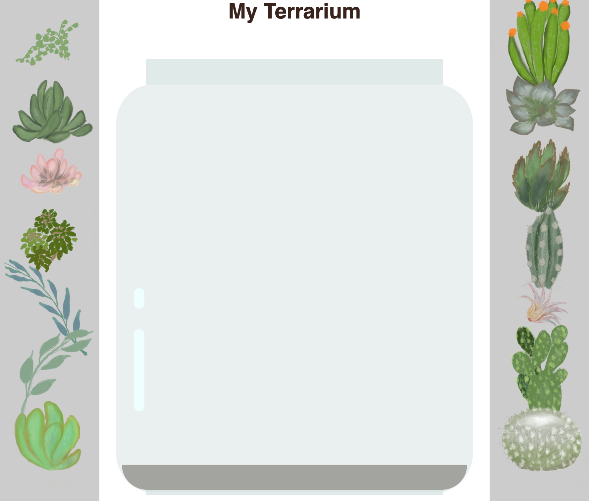

# Sub Topic 1 (Intro to HTML) :

## Challenge :
There are some wild 'older' tags in HTML that are still fun to play with, though you shouldn't use deprecated tags such as these tags in your markup. Still, can you use the old `<marquee>` tag to make the h1 title scroll horizontally? (if you do, don't forget to remove it afterwards)


### Solution :

These is the HTML code where the h1 title scroll horizontally by using the `<marquee>` tag

```html
<!DOCTYPE html>
<html lang="en">
<head>
    <meta charset="UTF-8">
    <meta name="viewport" content="width=device-width, initial-scale=1.0">
    <title>Document</title>
    <link rel="stylesheet" href="./style.css">
</head>
<body>
    <marquee>My Terrarium</marquee>
    <!-- There is the same block of div are present here ... -->
    <script src="./script.js" defer></script>
</body>
</html>
```

By changing `h1` tag to `marquee` tag the title `My Terrarium` will scroll from right to left. We can also change the direction of the scrolling, we can make it to move from right to left, top to bottom, left to right and so on by adding extra properties and values.


## Assignment :
Imagine you are designing, or redesigning, your personal web site. Create a graphical mockup of your site, and then write down the HTML markup you would use to build out the various elements of the site. You can use software of your choice, just make sure to hand-code the HTML markup. (Just a simple design is enough)

### HTML Markup :

This is some basic html markup and information which I will display in my website:

``` html
<!DOCTYPE html>
<html lang="en">
<head>
    <meta charset="UTF-8">
    <meta name="viewport" content="width=device-width, initial-scale=1.0">
    <title>Document</title>
</head>
<body>
    <h1>Potuboina Chandra Mouli</h1>
    
    <ul>
        <li>
            <h2>CSE in Amrita</h2>
        </li>
    </ul>
    <h2><u>Contact Information :</u></h2>
    <ul>
        <li><h3>email : mouli7xxx@gmail.com</h3></li>
        <li><h3>Phone : 7989xxxx62</h3></li>
        <li><h3>Github : https://github.com/wavexnani</h3></li>
    </ul>
    <h2><u>Education :</u></h2>
    <ul>
        <li><h3>School : XYZ</h3></li>
        <li><h3>Inter : PQR</h3></li>
        <li><h3>Degree : ABC</h3></li>
    </ul>
    <h2><u>Skills :</u></h2>
    <ul>
        <li><h3>Education : Got, z outoff 1000 in Inter</h3></li>
        <li><h3>Games : silver in karati</h3></li>
    </ul>
    <h2><u>Projects :</u></h2>
    <ul>
        <li><h3><a href="https://github.com/wavexnani">Github</a></h3></li>
    </ul>
</body>
</html>
```


# Sub Topic 2 (Intro to CSS) :

## Challenge :

Add a 'bubble' shine to the left bottom area of the jar to make it look more glasslike. You will be styling the .jar-glossy-long and .jar-glossy-short to look like a reflected shine. Here's how it would look:

### Solution :

```css
.jar-glossy-long {
    width: 2%;
    height: 25%;
    margin: 30% 0 0 6%;
    border-radius: 40px;
    background: white;
}

.jar-glossy-short {
    width: 2%;
    height: 7%;
    margin: 4% 0 0 6%;
    border-radius: 40px;
    background: white;
}

```


By adding this two blocks into the style.css we can get shine like effect in the final terrarium.




## Assignment :

Restyle the terrarium using either Flexbox or CSS Grid, and take screenshots to show that you have tested it on several browsers. You might need to change the markup so create a new version of the app with the art in place for your refactor. Don't worry about making the elements draggable; only refactor the HTML and CSS for now.


### Solution :

```css
 h1 {
    color: #3a241d;
	text-align: center;
   }

body {
	font-family: helvetica, arial, sans-serif;
}

#left-container {
	background-color: #eee;
	width: 15%;
	left: 0px;
	top: 0px;
	position: absolute;
	height: 100%;
	padding: 10px;
}

#right-container {
	background-color: #eee;
	width: 15%;
	right: 0px;
	top: 0px;
	position: absolute;
	height: 100%;
	padding: 10px;
}

.plant-holder {
	position: relative;
	height: 13%;
	left: -10px;
}

.plant {
	position: absolute;
	max-width: 150%;
	max-height: 150%;
	z-index: 2;
}

/* The edited code starts here, which I have used the flex properties */

#terrarium {
    display: flex;
    flex-direction: column;
    justify-content: center;
    align-items: center;
    margin-top: 4%;
}

.jar-top {
    background-color: #d1e1df;
    width: 50%;
    height: 40px;
    opacity: 0.7;
	z-index: 1;
}

.jar-walls {
    background-color:#d1e1df;
    width: 60%;
    height: 600px;
    border-radius: 5rem;
    opacity: 0.5;
	z-index: 1;
}

.dirt {
    background-color:#3a241d;
    width: 55%;
    height: 40px;
    position: absolute;
    top: 91.9%;
    border-radius:0 0 5rem 5rem;
    opacity: 0.7;
}

.jar-bottom {
    background-color:#d1e1df;
    width: 47%;
    height: 12px;
    opacity: 0.7;
}


.jar-glossy-long {
    width: 2%;
    height: 25%;
    margin: 30% 0 0 6%;
    border-radius: 40px;
    background: white;
}

.jar-glossy-short {
    width: 2%;
    height: 7%;
    margin: 4% 0 0 6%;
    border-radius: 40px;
    background: white;
}
```

Here is the updated css, which I have made the terrarium using the `display : flex` property.


# Sub Topic 3 (DOM Manipulation and a Closure) :

## Challenge :

Create a program that is written first with logical operators, and then rewrite it using a ternary expression. What's your preferred syntax?

### Solution :

Here is the java script code where I updated the code with `onclick` and `ondbclick` where, by clicking the element once the opacity of the element will be decreased. And by double clicking the element you can get the element to the top if the element is below to any other element.

```js
dragElement(document.getElementById('plant1'));
dragElement(document.getElementById('plant2'));
dragElement(document.getElementById('plant3'));
dragElement(document.getElementById('plant4'));
dragElement(document.getElementById('plant5'));
dragElement(document.getElementById('plant6'));
dragElement(document.getElementById('plant7'));
dragElement(document.getElementById('plant8'));
dragElement(document.getElementById('plant9'));
dragElement(document.getElementById('plant10'));
dragElement(document.getElementById('plant11'));
dragElement(document.getElementById('plant12'));
dragElement(document.getElementById('plant13'));
dragElement(document.getElementById('plant14'));

let zIndexCounter = 1;

function dragElement(terrariumElement) {
	//set 4 positions for positioning on the screen
	let pos1 = 0,
		pos2 = 0,
		pos3 = 0,
		pos4 = 0;
	terrariumElement.onpointerdown = pointerDrag;
    terrariumElement.ondblclick = bringToFront; // Double-click event
    terrariumElement.onclick = highlightPlant;  // Single-click effect

    function pointerDrag(e) {
        e.preventDefault();
        console.log(e);
        pos3 = e.clientX;
        pos4 = e.clientY;
        document.onpointermove = elementDrag;
        document.onpointerup = stopElementDrag;
    }

    function elementDrag(e) {
        pos1 = pos3 - e.clientX;
        pos2 = pos4 - e.clientY;
        pos3 = e.clientX;
        pos4 = e.clientY;
        console.log(pos1, pos2, pos3, pos4);
        terrariumElement.style.top = terrariumElement.offsetTop - pos2 + 'px';
        terrariumElement.style.left = terrariumElement.offsetLeft - pos1 + 'px';
    }

    function stopElementDrag() {
        document.onpointerup = null;
        document.onpointermove = null;
    }

    function bringToFront () {
        zIndexCounter++;
        terrariumElement.style.zIndex = zIndexCounter;
    }

    function highlightPlant() {
        terrariumElement.style.opacity = '0.6';
        setTimeout(() => {
            terrariumElement.style.opacity = '1';
        }, 300);
    }


}

```

You can also check the js file, where it is in this repository and named as `task.js`.


## Assignment :

Research the DOM a little more by 'adopting' a DOM element. Visit the MDN's list of DOM interfaces and pick one. Find it being used on a web site in the web, and write an explanation of how it is used.

### Documentation on ReactDOM :

Well you can find this documentation on ReactDOM [here](./ReactDOM.md).

